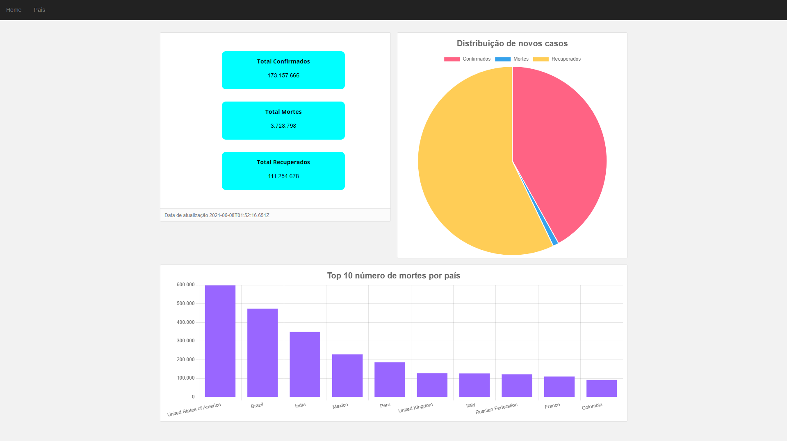
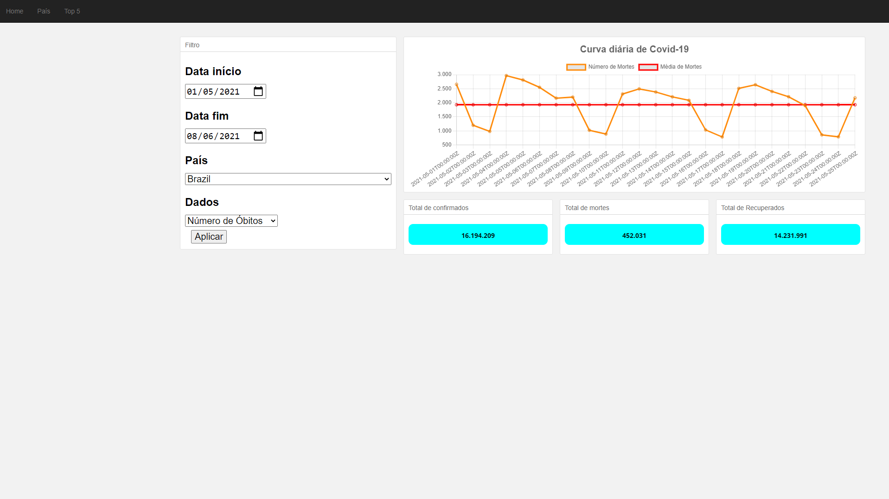

#
## Covid DashBoard Graphic Status:

Test here: covid-dashboard-graphics.netlify.app

##### - Dashboard:
- Total Casos confirmados
- Total Mortes
- Total Recuperados
- Total Casos ativos

##### - Top 10 países com mais casos: 
- Confirmados
- Mortes
- Recuperados
##### - Dados de países por intervalo de dados
- Gráfico de linhas para o período selecionado
    - Confirmados
    - Mortes
    - Recuperados

## Tecnologias utilizadas:
- HTML5 
- CSS
- JavaScript

## Libs:
- AXIOS -> [More info](https://axios-http.com)

- LODASH -> [More info](https://lodash.com)

- CHART JS -> [More info](https://www.chartjs.org)

## API utilizada:
> https://covid19api.com
>
> Documentação: https://documenter.getpostman.com/view/10808728/SzS8rjbc

---
